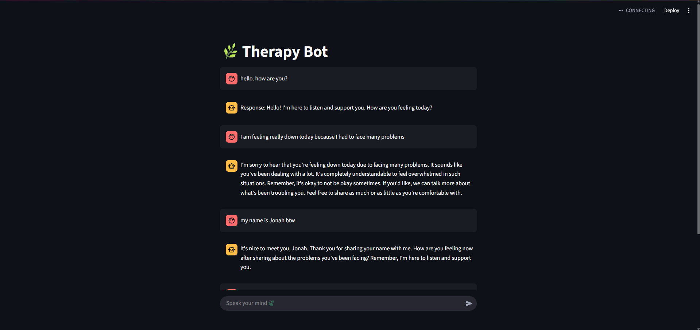
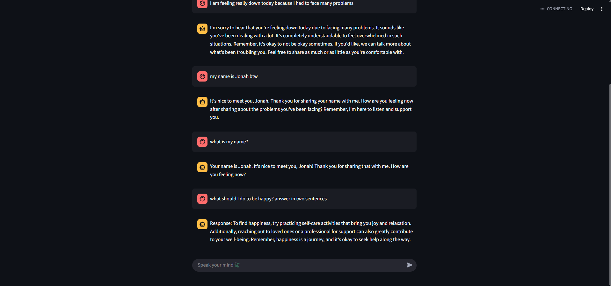

# 🌿 CalmMind - Therapy Bot

(No medical advice is provided. CalmMind is for emotional support and listening only.)

Therapy Bot is an empathetic, conversational therapy chatbot built with the ChatGPT API, LangChain, and Streamlit. It provides a safe, non-judgmental space where users can share their feelings and receive calm, compassionate responses — not diagnoses.

# 💡 Features

GPT-powered therapy-style conversation
Empathetic and calming response generation
LangChain-powered chat prompt chaining
Streamlit frontend with real-time conversation
Maintains session history during the chat
Secure API key management using .env or st.secrets

# 📸 Demo

# 🛠 Tech Stack

OpenAI GPT-4 API
LangChain
Streamlit
Python

# 📌 Notes

No medical advice is provided. It is for emotional support and listening only.

# 🙏 Credits

Inspired by the need for more accessible, empathetic support.
Built with ❤️ using OpenAI and Streamlit.
